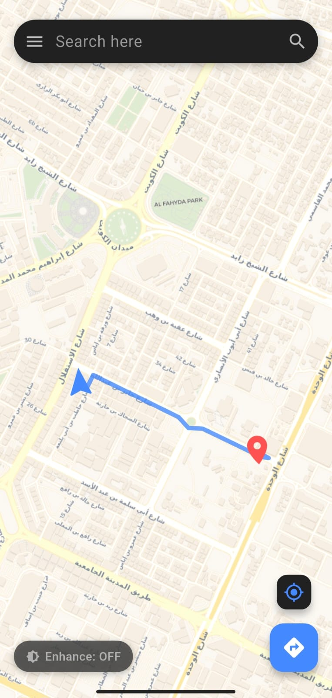
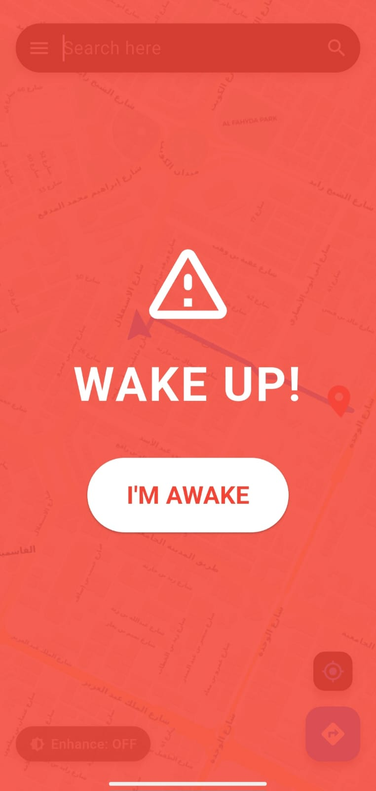
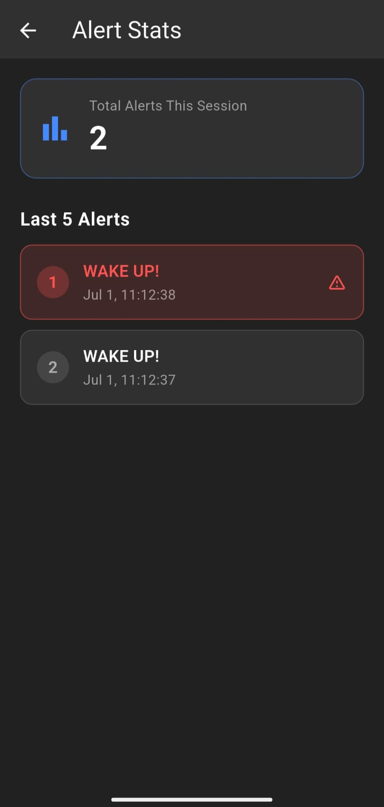
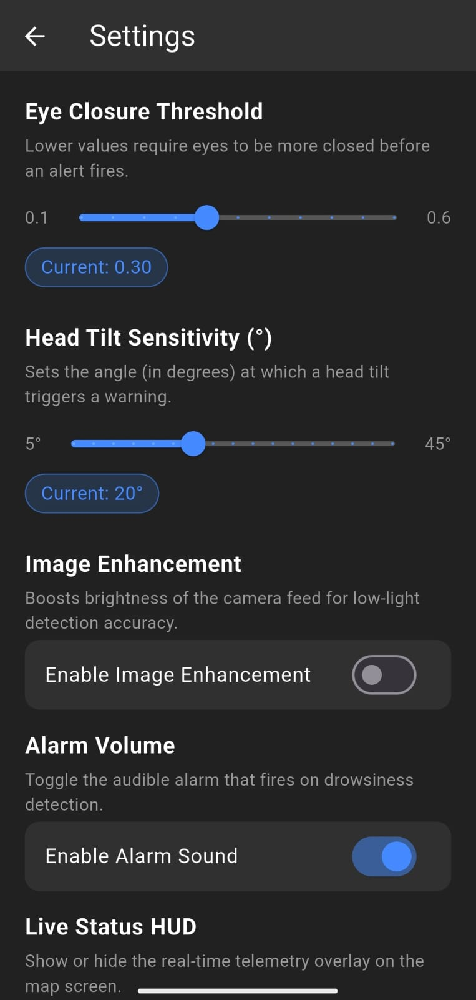

# 👁️ Iris Maps

Iris Maps is a Flutter-based safety assistant for drivers that combines real-time navigation with on-device computer vision. The app monitors driver alertness, highlights suspicious drowsiness patterns, and can trigger an audible wake-up alarm when attention appears to drop.

## What the app does

- Detects possible drowsiness using the device camera and face analysis.
- Uses on-device AI models and ML Kit face landmarks to estimate eye state.
- Displays a live map with GPS location, destination search, and route drawing.
- Provides a wake-up alarm and visual feedback to encourage the driver to stay alert.
- Includes settings and stats screens for tuning and reviewing behavior.

## Key features

- Real-time camera feed for driver monitoring
- Eye-state classification using TensorFlow Lite and ML Kit
- Live map rendering with OpenStreetMap-based tiles
- Route fetching from OSRM and destination search through Nominatim
- Audio alert playback with a local alarm asset
- Developer-friendly camera overlay and telemetry mode

## Tech stack

- Flutter and Dart
- Camera plugin for live frame capture
- Google ML Kit Face Detection for landmark extraction
- TensorFlow Lite via tflite_flutter for on-device inference
- flutter_map and latlong2 for map rendering and coordinates
- geolocator for GPS access
- audioplayers for alarm playback
- http for routing and geocoding APIs

## Project structure

- lib/main.dart: main app UI, map screen, camera loop, navigation logic
- lib/screens/settings_screen.dart: configurable app settings
- lib/screens/stats_screen.dart: alert and usage statistics UI
- lib/services/: camera, head-pose, image-enhancement, and eye-classification services

## Prerequisites

- Flutter SDK 3.11 or newer
- Android SDK with camera and location support
- A physical Android device is strongly recommended for reliable camera-based monitoring

## Getting started

1. Clone the repository

   ```bash
   git clone https://github.com/WafeeqAthaaullah/IrisMaps.git
   cd IrisMaps
   ```

2. Install dependencies

   ```bash
   flutter pub get
   ```

3. Run the app

   ```bash
   flutter run
   ```

4. Build a release APK if needed

   ```bash
   flutter build apk --release
   ```

## App screenshots







## Notes

- This application is intended as a safety aid and should not be treated as a medical device.
- Camera and location permissions are required for full functionality.
- The app is optimized for Android and uses device hardware for real-time inference.

## License

This project is licensed under the MIT License.
